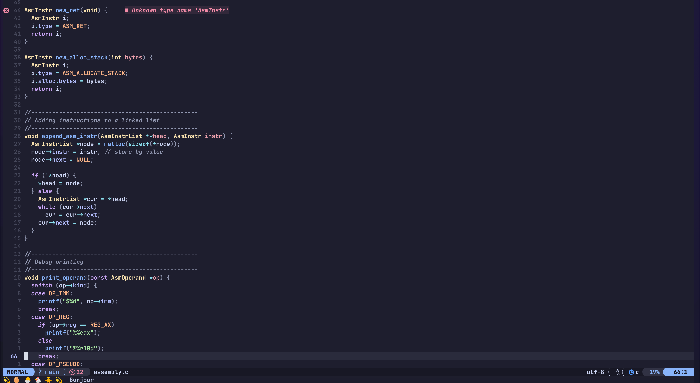
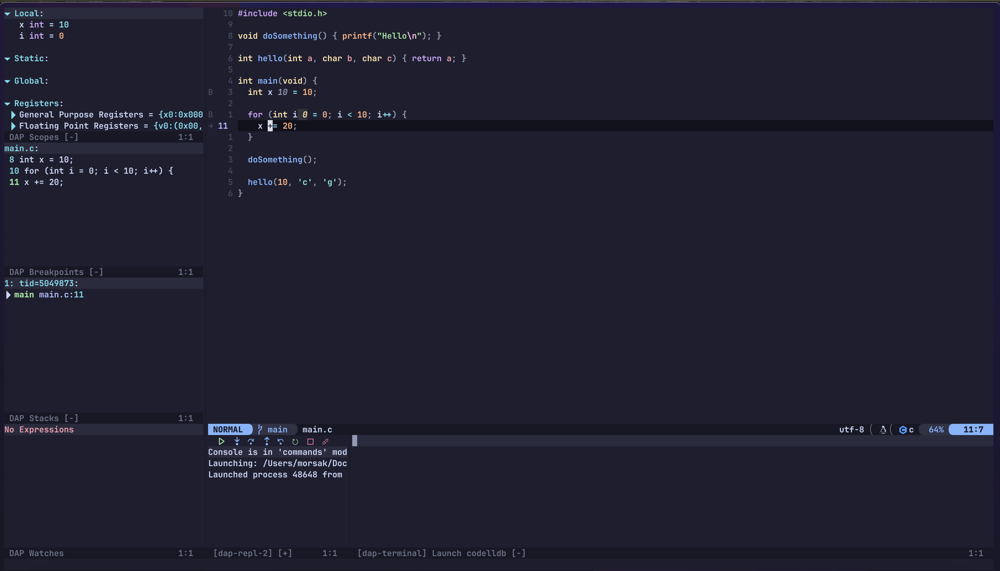
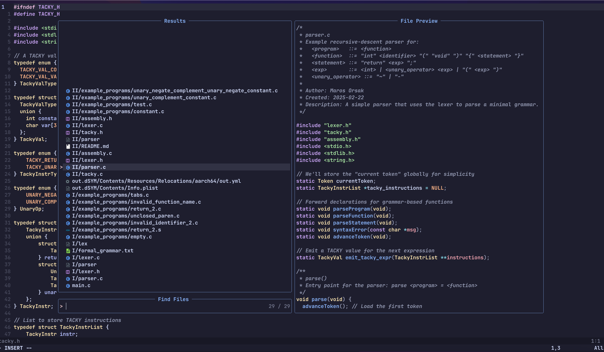
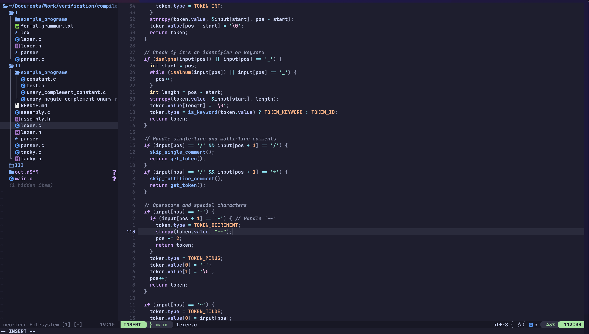

# Neovim Configuration

Welcome to mynice **Neovim configuration**! This setup is designed to enhance the Neovim experience with modern plugins, better autocompletion, and smooth development workflows.

## 🚀 Features
- **LSP Support**: Configured via `nvim-lspconfig` with `mason.nvim` for easy installation.
- **Autocompletion**: Powered by `coq_nvim` for fast and smooth completion.
- **Debugging**: Integrated with `nvim-dap` and `mason.nvim` for seamless debugging.
- **Syntax Highlighting**: Enhanced with `treesitter` for better code visibility.
- **File Management**: File operations handled by `nvim-tree` and Telescope for fuzzy searching.
- **Custom Keybindings**: Efficient mappings for LSP, DAP, and navigation.

## 📂 Folder Structure
```
.
├── README.md
├── init.lua
├── lazy-lock.json
├── lua
│   ├── config
│   │   ├── core
│   │   │   ├── init.lua
│   │   │   ├── keymaps.lua
│   │   │   └── options.lua
│   │   └── lazy.lua
│   └── plugins
│       ├── autocomplete.lua
│       ├── colourscheme.lua
│       ├── dap.lua
│       ├── dressing.lua
│       ├── lsp
│       │   ├── lspconfig.lua
│       │   ├── mason.lua
│       │   └── save
│       │       └── lspconfig.lua
│       ├── nvim-cmp.lua
│       ├── save
│       │   └── dap.lua
│       ├── telescope.lua
│       ├── treesitter.lua
│       └── undotree.lua
└── pack
    └── nvim
        └── start
            └── nvim-lspconfig
            ...
```

## 📦 Installation
### Prerequisites
Ensure you have the following installed:
- **Neovim (>= 0.9.0)**
- **Git**
- **Python3**
- **Node.js & npm** (for some LSP servers)
- **ripgrep** (for better searching in Telescope)

### Clone and Install
```sh
# Clone this repository
git clone https://github.com/your-username/nvim-config.git ~/.config/nvim

# Open Neovim and install plugins
nvim +Lazy sync +qall
```

📷 Screenshots


Code Editing



Debugger UI



Telescope Fuzzy Finder



NeoTree 




## 🔧 Configuration Overview
### **LSP & Mason**
LSP servers are managed via **mason.nvim**:
```lua
require("mason").setup()
require("mason-lspconfig").setup({
  ensure_installed = { "clangd", "lua_ls", "pyright", "bashls" },
})
```

### **Autocompletion with coq_nvim**
```lua
vim.g.coq_settings = {
  auto_start = "shut-up",
  clients = {
    lsp = { enabled = true },
    snippets = { enabled = true },
  },
}
require("coq")
```

### **DAP (Debugging Support)**
```lua
require("dapui").setup()
require("mason-nvim-dap").setup({ ensure_installed = { "codelldb" } })
```

## 🎮 Keybindings
| Action | Keybinding |
|--------|-----------|
| LSP Hover | `K` |
| Code Actions | `<leader>ca` |
| Rename Symbol | `<leader>rn` |
| Show Diagnostics | `<leader>d` |
| Debug Start | `<F5>` |
| Debug Step Over | `<F10>` |
| Debug Step Into | `<F11>` |
| Debug Step Out | `<F12>` |
| Toggle DAP UI | `<leader>du` |

## 🛠️ Troubleshooting
- **Plugins not loading?** Run `:Lazy sync` inside Neovim.
- **LSP not working?** Check `:LspInfo` and ensure servers are installed.
- **Coq not auto-starting?** Run `:COQnow` manually.

## 📜 License
This Neovim configuration is open-source. Feel free to modify and improve it! 🚀


